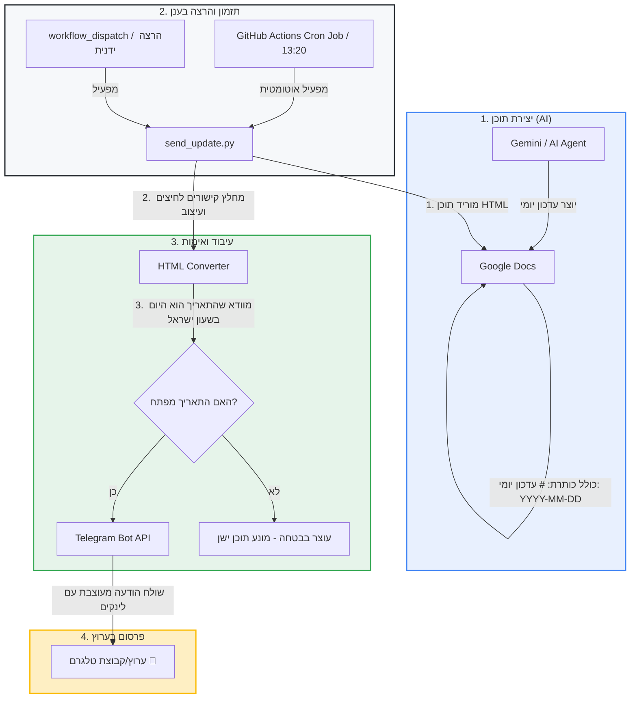

# 🚀 מדריך מקיף: אוטומציית ניוזלטר מ-Google Docs ל-Telegram בעזרת GitHub Actions

מדריך זה מסביר כיצד להקים ולהפעיל מערכת אוטומטית מלאה (E2E) המפרסמת עדכונים יומיים מ-Google Docs לערוץ טלגרם, ללא צורך בשרת מיועד וללא תלות במחשב המקומי.

---

## 📐 ארכיטקטורת המערכת (System Flow Diagram)



---

## 🛠️ רכיבי הפתרון

1. **Google Docs (מקור התוכן):**
   - המסמך מתעדכן מדי יום ע"י ג'מיני או כותב התוכן.
   - כל עדכון יומי מפתח כותרת במבנה המדויק: `# עדכון יומי: YYYY-MM-DD` (לדוגמה: `# עדכון יומי: 2026-08-08`).
   - **הגדרת שיתוף:** המסמך פתוח לצפייה לכל מי שיש לו את הקישור (`Anyone with the link can view`).

2. **GitHub Actions (תזמון והרצה מבוססת ענן):**
   - הקובץ `.github/workflows/send-daily-update.yml` מריץ את הג'וב אוטומטית לפי תזמון Cron.
   - מריץ סביבת Python 3.11, מתקין תלויות (`requests`, `beautifulsoup4`, `tzdata`), ומריץ את `send_update.py`.

3. **שדרן ה-Python (`send_update.py`):**
   - מוריד את פורמט ה-HTML מ-Google Docs.
   - **מחלץ קישורים לחיצים:** מנקה קישורי הפניה של גוגל (`google.com/url?q=...`) וממיר אותם לקישורי HTML ישירים לטלגרם (`<a href="...">`).
   - **שומר על עיצוב עשיר:** תומך ב-Bold (`<b>`), Italics (`<i>`), ורשימות בולטים (`•`).
   - **אימות תאריך יום:** מוודא שהעדכון האחרון במסמך נכתב היום לפי אזור הזמן של ישראל (`Asia/Jerusalem`).

---

## ⚙️ שלבי ההקמה (Step-by-Step Setup Guide)

### שלב 1: הגדרת מפתחות אבטחה ב-GitHub Secrets
במאגר ה-GitHub שלך, היכנס ל:
**Settings → Secrets and variables → Actions → New repository secret**

הוסף את 3 ה-Secrets הבאים:
* `TELEGRAM_BOT_TOKEN`: הטוקן שקיבלת מ-`@BotFather` בטלגרם.
* `TELEGRAM_CHAT_ID`: מזהה הערוץ, הקבוצה או הצ'אט בטלגרם (לדוגמה: `-100123456789`).
* `DOC_ID`: מזהה ה-Google Doc שלך מתוך הקישור (החלק שמופיע בין `/d/` ל-`/edit`).

### שלב 2: הגדרת תזמון ב-GitHub Actions
הקובץ `.github/workflows/send-daily-update.yml` כולל הגדרת תזמון:
```yaml
on:
  schedule:
    # מורץ אוטומטית בשעה 13:20 שעון ישראל (10:20 UTC)
    - cron: '20 10 * * *'
  workflow_dispatch:
```

### שלב 3: הרצה מקומית לצורכי פיתוח (אופציונלי)
אם ברצונך לבדוק את הסקריפט במחשב האישי:
1. צור קובץ `.env` בתיקיית הפרויקט:
   ```env
   TELEGRAM_BOT_TOKEN=your_bot_token
   TELEGRAM_CHAT_ID=your_chat_id
   DOC_ID=your_doc_id
   ```
2. התקן תלויות והרץ:
   ```bash
   python -m venv venv
   .\venv\Scripts\pip install -r requirements.txt
   .\venv\Scripts\python send_update.py
   ```

---

## 🛡️ מנגנוני הגנה ואבטחה מובנים

- **ללא סודות בקוד:** מזהה ה-Doc והטוקנים שמורים אך ורק ב-GitHub Secrets.
- **הגנה מפרסום תוכן ישן:** אם ג'מיני לא עדכן את ה-Doc באותו יום, ה-Workflow ייעצר בבטחה ולא ישלח הודעות ישנות.
- **הגנת Timeouts לרשת:** מוגדרים תוחמי זמן (Connect/Read timeouts) למניעת תקיעת התהליך.
