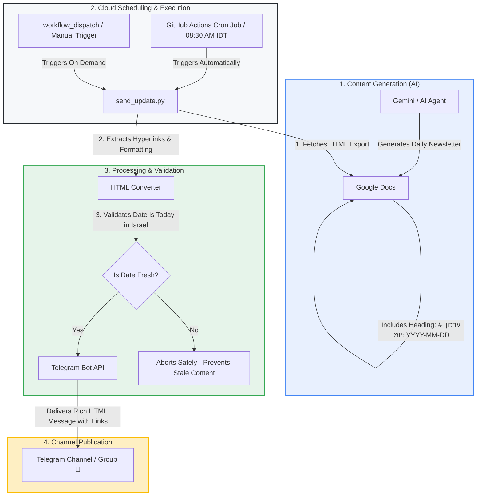

# 🚀 Sparknewsletter: Automated Google Docs to Telegram Publishing Pipeline

A complete end-to-end (E2E), cloud-native publishing pipeline that automatically fetches daily updates from Google Docs, parses rich HTML formatting and clickable hyperlinks, validates date freshness in Israel timezone, and publishes to a Telegram channel via GitHub Actions.

---

## 📐 System Architecture Diagram



---

## 🛠️ System Components

1. **Google Docs (Content Store):**
   - Updated daily by Gemini or content creators.
   - Each daily section must begin with a heading matching `# עדכון יומי: YYYY-MM-DD` (e.g., `# עדכון יומי: 2026-08-08`).
   - **Access Requirement:** General access set to `Anyone with the link can view`.

2. **GitHub Actions (Cloud Execution):**
   - `.github/workflows/send-daily-update.yml` triggers daily on a scheduled cron (`30 5 * * *` = 08:30 AM Israel Summer Time).
   - Runs Python 3.11, installs dependencies (`requests`, `beautifulsoup4`, `tzdata`, `python-dotenv`), and executes `send_update.py`.

3. **Python Publisher Engine (`send_update.py`):**
   - **HTML Export Fetching:** Fetches formatted HTML directly from Google Docs (`export?format=html`).
   - **Hyperlink Extraction:** Extracts clickable links and cleans Google redirect wrappers (`google.com/url?q=...`) to point directly to target URLs.
   - **Rich Formatting Preservation:** Converts headings, bold (`<b>`), italics (`<i>`), and bullet lists (`•`) into native Telegram HTML (`parse_mode="HTML"`).
   - **Date Validation:** Verifies the latest section date matches today in Israel timezone (`Asia/Jerusalem`). If stale, aborts publishing to prevent duplicate/old posts.
   - **Network Safety:** Uses explicit connect (10s) and read (30s) timeouts for HTTP calls.

---

## ⚙️ Step-by-Step Setup Guide

### Step 1: Configure GitHub Repository Secrets
Navigate to your GitHub repository:
**Settings → Secrets and variables → Actions → New repository secret**

Add the following 3 secrets:
* `TELEGRAM_BOT_TOKEN`: Bot token obtained from `@BotFather`.
* `TELEGRAM_CHAT_ID`: Target Telegram channel, group, or chat ID (e.g., `-100123456789`).
* `DOC_ID`: The Google Doc ID extracted from the document URL (between `/d/` and `/edit`).

### Step 2: Configure Workflow Schedule
The workflow file `.github/workflows/send-daily-update.yml` defines the cron schedule:
```yaml
on:
  schedule:
    # Runs daily at 08:30 AM Israel Summer Time (05:30 UTC)
    - cron: '30 5 * * *'
  workflow_dispatch:
```

### Step 3: Local Development & Testing (Optional)
To run and test the publisher script locally:
1. Create a `.env` file in the project root:
   ```env
   TELEGRAM_BOT_TOKEN=your_telegram_bot_token
   TELEGRAM_CHAT_ID=your_telegram_chat_id
   DOC_ID=your_google_doc_id
   ```
2. Set up virtual environment and run:
   ```bash
   python -m venv venv
   .\venv\Scripts\pip install -r requirements.txt
   .\venv\Scripts\python send_update.py
   ```

---

## 🛡️ Built-in Protections & Security

- **Zero Hardcoded Credentials:** Tokens and document IDs are strictly managed via GitHub Secrets.
- **Stale Content Guard:** Refuses to publish if the Google Doc update date doesn't match today's date in Israel.
- **Network Resilience:** Robust timeout handling and automatic retry protection.
